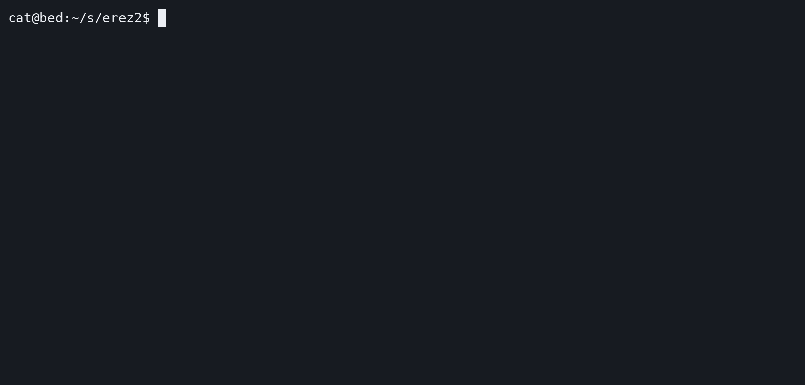

# Erez

Exploration in eBPF-based per-packet latency-aware multipath routing.

## FAQ

### Q: How does routing work?

`erezd` is a daemon that runs on metals in *encap* mode, and on edge routers in
*decap* mode.

- On metals, it peers with BGP routers to learn nexthops per prefix. It
  addresses outbound packets to specific nexthops by encapsulating them in
  IPv6/GRE and encoding the nexthop address in the IPv6 packet itself.
- On routers, it strips the IPv6/GRE header, parses the nexthop, and forwards
  the inner packet through it.
- Each encap daemon monitors TCP RTT per nexthop and uses Online Gradient
  Descent (OGD) to steer traffic towards low-latency paths, whilst avoiding
  congested ones

### Q: How do I play around with it?

#### Topology Overview

I've defined an example lab environment (which uses Linux namespaces) to
virtualise the following network topology:

```
┌───────────┐                               ┌───────────┐
│           │                               │ Transit A │
│  Metal 1  │────┐                     ┌────│           │────┐
│           │    │    ┌───────────┐    │    │ ASN 64512 │    │    ┌───────────┐    ┌───────────┐
└───────────┘    │    │   Edge    │    │    └───────────┘    │    │  Origin   │    │           │
                 ├────│           │────┤                     ├────│           │────│   Metal   │
┌───────────┐    │    │ ASN 4181  │    │    ┌───────────┐    │    │ ASN 64514 │    │           │
│           │    │    └───────────┘    │    │ Transit B │    │    └───────────┘    └───────────┘
│  Metal 2  │────┘          │          └────│           │────┘          │
│           │                               │ ASN 64513 │
└───────────┘          172.16.0.0/24        └───────────┘          10.41.0.0/24
                      3ffff:172:16::/64                           3ffff:10:41::/64
```

A traffic generator on "Metal 1" transmits packets to the origin metal, sending
between 5-15 Mbps in a smooth cycle over two minutes. These packets travel
through an edge router, which connects to the origin through two upstream
transits. The router selects one best path and forwards all packets through it.

Now, whether that's Transit A or Transit B, neither is ideal for all traffic:

  - **Transit A** is low-latency (1ms) but limited to 9 Mbps. When the rate
    exceeds Transit A's capacity, it congests and latency spikes.
  - **Transit B** is high-latency (100ms) but unconstrained. If the router
    chose Transit B instead, every packet pays an additional 100ms penalty that
    could've been avoided.

Instead, Erez monitors the health of each transit, and steers packets between
them. It favours Transit A while it's healthy, shifts load to Transit B as
congestion builds, and shifts back as the rate drops.

We can run the lab to watch Erez work in-practice!

#### Running The Lab

First thing's first, install the dependencies. If you're running on Debian you
can use the Makefile to do this.

```sh
> make install-deps
```

Run the example using Make, and it will load up a REPL we can use to interact
with the lab!

```
> make example/lab
Loading lab...
>> help
Usage: <COMMAND>

Commands:
  info   Show info about all namespaces in the topology
  exec   Run a command inside a namespace
  logs   Stream live log output from all namespaces
  pcap   Manage packet captures across all network namespaces
  clear  Clear the terminal
  exit   Exit the REPL
  help   Print this message or the help of the given subcommand(s)

Options:
  -h, --help  Print help
```

Both the encapsulation daemon and the traffic generator emit metrics that can
be scraped. Below I've curated a subset of metrics which can be used to figure
out the steering state and nexthop health.

```
>> exec edge_metal_1 watch -n 0.5 \
   'curl -s http://localhost:9100/metrics | grep -v "#" | sort && \
    curl -s http://localhost:9101/metrics | grep -v "#" | sort'
Every 0.5s: curl -s http://localhost:9100/metrics | grep -v "#" | sort && curl -s http://localhost:9101/metrics | grep -v "#" | sort             

# What are the weights for each nexthop?
#
# Note that:
#   - All weights sum to 10,000.
#   - 10.41.0.1 is the address of the origin metal.
#   - 3fff:ffff:1::2 is the address of Transit A.
#   - 3fff:ffff:3::2 is the address of Transit B.
erez_steering_nexthop_weight{nlri="10.41.0.1/32",nexthop="3fff:ffff:1::2"} 8499
erez_steering_nexthop_weight{nlri="10.41.0.1/32",nexthop="3fff:ffff:3::2"} 1501

# What is the smoothed average and minimum RTT observed
# for each nexthop over the last 10 seconds? Units are
# in microseconds.
erez_tcp_rtt_window_rtt_min_us_min{nlri="10.41.0.1/32",nexthop="3fff:ffff:1::2"} 1015
erez_tcp_rtt_window_rtt_min_us_min{nlri="10.41.0.1/32",nexthop="3fff:ffff:3::2"} 100000
erez_tcp_rtt_window_srtt_us_avg{nlri="10.41.0.1/32",nexthop="3fff:ffff:1::2"} 27427
erez_tcp_rtt_window_srtt_us_avg{nlri="10.41.0.1/32",nexthop="3fff:ffff:3::2"} 802556

# What rate is the traffic generator currently sending at?
traffic_generator_rate_kbps 5424
```

You should see that as the rate increases, Erez shifts over to Transit B, and
then back to Transit A. I've recorded a GIF so you can see what it's expected
to look like.


